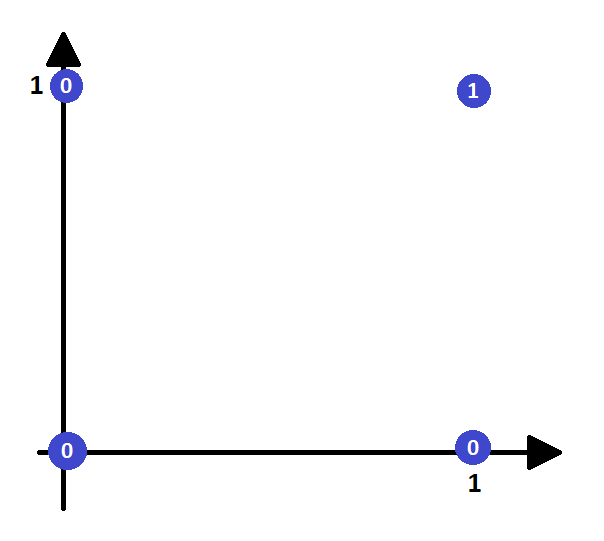
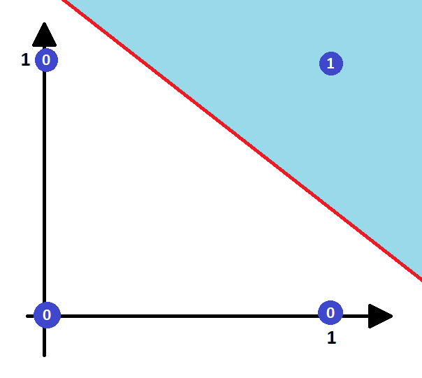

# Algoritmos de inteligencia artificial

* [Single-Layer Perceptron](https://github.com/danielaraujorn/algoritmos_IA/)
* [Multi-Layer Perceptron](https://github.com/danielaraujorn/algoritmos_IA/tree/multilayer)

## Single Layer Perceptron, como funciona:

O funcionamento de uma rede neural de um neurônio só serve para classificar problemas lineares. Por exemplo, caso seja um problema de duas dimensões, deve ser possivel separar as amostrar por uma reta.
Digamos que estamos tentando treinar a rede neural para funcionar como a porta lógica AND, as amostras serão distribuídas como o gráfico a seguir:



A rede neural então precisa aprender a traçar uma reta que definirá a classificação, uma das possíveis soluções seria a seguinte:



#### Como funcionar?

Cada amostra de treinamento terá entradas e uma saída, mas para treinar para mais casos é necessário ter vários conjuntos de amostras. Vou mostrar um exemplo da porta lógica AND:

```js
//entrada_das_amostras é um array em que cada item
//é uma amostra de entrada para o treinamento
const entrada_das_amostras = [[1, 1], [1, 0], [0, 1], [0, 0]];

//saida_das_amostras é um array em que para cada elemento do array entrada_das_amostras,
//diz como o elemento deve ser classificado
const saida_das_amostras = [1, 0, 0, 0];
```

ou seja, para a entrada [1,1] a rede neural deve resultar em 1, para [1,0], [0,1] ou [0,0] a rede neural deve resultar em 0.

A rede neural vai funcionar baseada em pesos (inicializados aleatoriamente na criação da rede) associados para cada entrada, esses pesos são atualizados no processo de treinamento. Para que a reta traçada pela rede neural não fique localizada na origem [0,0] é usado um bias(análogo ao threshold) com valor -1, e um pesso associado a ele que também será atualizado.

#### Vou citar as funções necessárias para o funcionamento da rede:

* vamos chamar de activation a: Função degrau que retorna 0 para qualquer valor abaixo de 0, e 1 caso o contrário.
* vamos chamar de multiply a: Função que somará a multiplicação entre as entradas e seus pesos também somado com a multiplicação entre o bias e seu peso
* vamos chamar de prediction a: Função que passa o resultado da multiply() pela função activation()
* vamos chamar de fit a: Função de treinamento que será explicada a seguir

#### Treinamento:

para cara época e cada peso é feita uma previsão(prediction) em seguida é comparada a saída esperada já dada. Em seguida existem alguns casos:

1.  Caso a entrada que está sendo analizada no momento seja 0, não se altera o peso.
1.  Caso a previsão tenha dada menor que a saída esperada é necessário decrementar o peso da entrada na qual está sendo comparada.
1.  Caso a previsão seja maior que a saída esperada é necessário incremenar o peso da entrada na qual está sendo comparada.
1.  Caso a previsão tenha dado igual a saída esperada, não se mexe no peso.

**O peso do bias será atualizado da mesma forma, porem a entrada é o bias**

**O peso será incrementado ou decrementado exatamento o LearningRate**(passo do aprendizado, quanto menor esse valor a rede neural será mais precisa mas também mais custosa computacionalmente)

Após treinar a single layer perceptron, é só usar a função prediction com a entrada à sua escolha

## Multi Layer Perceptron, como funciona:
